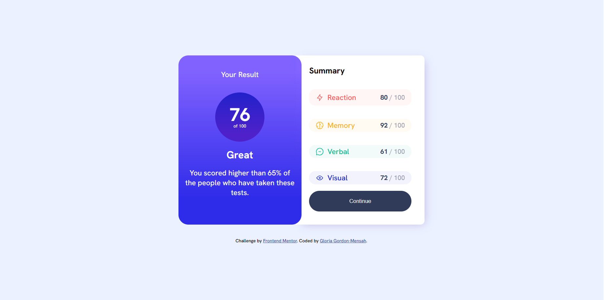

# Result-Summary

# Frontend Mentor - Results summary component solution

This is a solution to the [Results summary component challenge on Frontend Mentor](https://www.frontendmentor.io/challenges/results-summary-component-CE_K6s0maV). Frontend Mentor challenges help you improve your coding skills by building realistic projects. 

## Table of contents

- [Overview](#overview)
  - [The challenge](#the-challenge)
  - [Screenshot](#screenshot)
  - [Links](#links)
- [My process](#my-process)
  - [Built with](#built-with)
  - [What I learned](#what-i-learned)
  - [Continued development](#continued-development)
  - [Useful resources](#useful-resources)
- [Author](#author)
- [Acknowledgments](#acknowledgments)


## Overview

### The challenge

Users should be able to:

- View the optimal layout for the interface depending on their device's screen size
- See hover and focus states for all interactive elements on the page


### Screenshot



### Links

- Solution URL: [Add solution URL here](https://your-solution-url.com)
- Live Site URL: [Add live site URL here](https://your-live-site-url.com)

## My process

### Built with

- Semantic HTML5 markup
- CSS custom properties
- Flexbox
- CSS Grid
- Mobile-first workflow
- [Styled Components](https://styled-components.com/) - For styles


### What I learned
I learnt how to style in grid and flex box and how to work within the grids individually.
Also learn new ways to get the shadow of boxes as well as gradients using some websites as well.
Gradient was new to me because this was my firstb time working in a project with gradient/

To see how you can add code snippets, see below:

```html
<h1>Some HTML code I'm proud of</h1>
```
```css
.proud-of-this-css {
  color: papayawhip;
}
```
```js
const proudOfThisFunc = () => {
  console.log('🎉')
}
```

### Continued development
In my future projects, i'd like to focus more on gradients and working on grids with different styles for each grid .


### Useful resources
-(https://cssgradient.io) - This helped me with the gradients, i really liked it and will be using it a lot when necessary moving forward.

-(https://www.cssmatic.com/box-shadow) - This is an amazing website which helped with the shadows and how the box-shadows work. I'd recommend it to anyone whos trying to figure out box-shadows. It's really easy to use 

## Author

- Portofolio - [Gloria Gordon-Mensah](https://mhizgordon.github.io/Portofolio/)

- Frontend Mentor - [@MhizGordon] (https://www.frontendmentor.io/profile/MhizGordon)


## Acknowledgments
Practical Web Dev - https://www.youtube.com/watch?v=BU7zS4GQQgg

